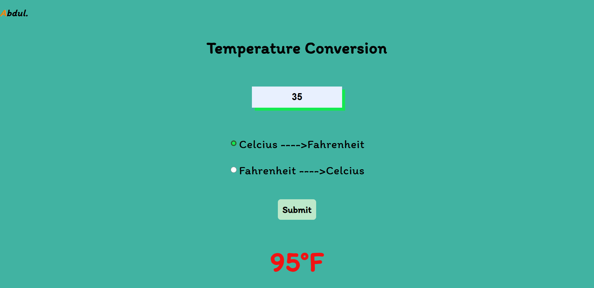

# Temperature Conversion using JS

## Overview

- Created this simple temperature converter using JS because i wanted to practice my JavaScript.

### The challenge

Users should be able to:

- See hover and focus states for all interactive elements on the page.

 - Convert the temperature according to their selection.

 ### Screenshot

### Links

- Solution URL: [https://github.com/abdulkadir023/Temperature-Converter](https://github.com/abdulkadir023/Temperature-Converter)
- Live Site URL: [https://my-temperature-converter.vercel.app/](https://my-temperature-converter.vercel.app/)

## Author

- GitHub - [@abdulkadir023](https://github.com/abdulkadir023/)